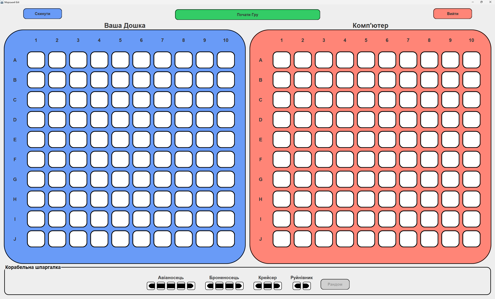

# Battleship Game (Java + Swing)

## Key Features

- Developed entirely in Java
- GUI built with Swing components
- Interactive player and computer boards
- Turn-based gameplay logic
- Random ship placement
- Reset, start and quit buttons 
- Smart AI for the computer's moves

## Development Team

This project was collaboratively developed by a team of five students:

- **Illia Tereshko**
- **Andrii Sosunovych**
- **Anna Chernovska**
- **Illia Bondarenko**
- **Anna Maleieva**

## Screenshots

